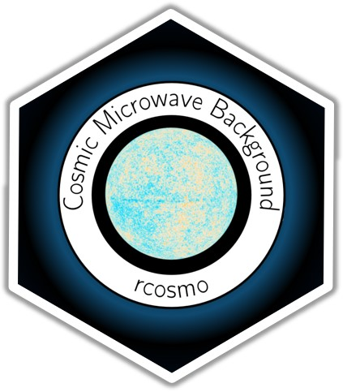
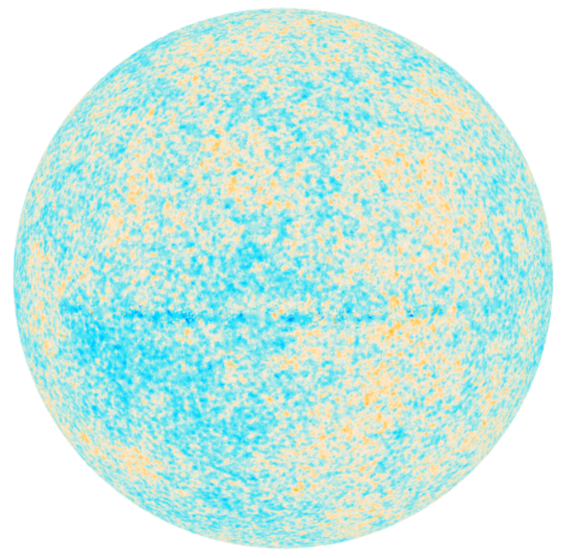

# Archived by CRAN

This package was recently archived by CRAN due to a temporary difficulty contacting the maintainer of geoR. The maintainer of geoR has now responded, so rcosmo will be back on CRAN soon.


# rcosmo: Handle and Analyse Spherical, HEALPix and Cosmic Microwave Background data on a HEALPix grid.




<!-- Badges Start -->
[](https://travis-ci.org/frycast/rcosmo) 
[](https://CRAN.R-project.org/package=rcosmo) 
[](https://CRAN.R-project.org/package=rcosmo) 
[](https://CRAN.R-project.org/package=rcosmo) 
[](https://CRAN.R-project.org/package=rcosmo) [](https://www.tidyverse.org/lifecycle/)
<!-- Badges End -->


<!-- [](https://codecov.io/github/frycast/rcosmo?branch=master) -->


Use this R package as an advanced toolkit for performing Cosmic Microwave Background (CMB) data analytics. The CMB is remnant electromagnetic radiation from the epoch of recombination. As an ancient source of data on the early universe, the CMB is helping us unlock the mysteries of the Big Bang and the structure of time and space. With increasingly high resolution satellite data, intensive investigations in the past few years have resulted in many physical and mathematical results to characterize CMB radiation.  

## Features

`rcosmo` addresses various data processing and statistical analysis needs for the present generation of CMB experiments. These needs fall into the following broad categories:
+ Importing and transforming HEALPix data in convenient `CMBDataFrame` class objects,
+ Geometric tools suited to spherical geometry,
+ Statistical tools suited to spherical random fields,
+ Interactive visualisation.

The current version of `rcosmo` includes the following functionality:
+	Tidy organisation of CMB data, including HEALPix indices, metadata, CMB intensities and their
  corresponding spherical and/or cartesian coordinates, as well as polarization data,
+	window subsetting tools for investigating circular, convex and non-convex polygonal sub-regions on the sphere,
+	fast empirical covariance and variogram estimation,
+	implementation and analysis of spherical harmonics, spherical wavelets, etc,
+	various methods for CMB map visualization, such as interactive 3D full sky maps rendered with OpenGL, polygon boundary visualisation, and HEALPix pixel boundary plotting,
+ spherical geometry tools, such as calculation of spherical angles, shortest distance between a point and a region, and shortest distance between two points, etc.


## Installation

From CRAN:

```r
## Uncomment to install
#install.packages('rcosmo')
```

## Usage

```r
library(rcosmo)
```

View the `CMBDataFrame` help file:

```r
?CMBDataFrame
```

Download a CMB map from NASA archives (which may take some time to download).
Then, take an approximately uniform random sample and create an interactive 3D plot:

```r
downloadCMBMap()
sky <- CMBDataFrame("CMB_map_smica1024.fits", sample.size = 1e6)
plot(sky)
```





Produce a summary of the map:

```r
summary(sky)
```

Extract a region of the sky:

```r
win <- CMBWindow(theta = c(pi/2,pi/2,pi/3, pi/3), phi = c(0,pi/3,pi/3,0))
sky_win <- window(sky, new.window = win)
plot(sky_win); plot(win)
```

Summarise the region of the sky:

```r
summary(sky_win)
```
More documentation on the way, for now view examples in the help files. There are many functions, see:

```r
lsf.str("package:rcosmo")
```
